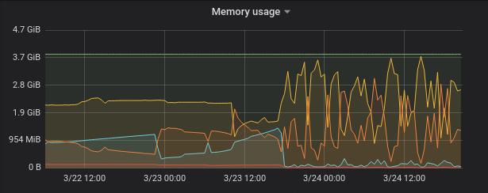

Last week I was involved in a problem that started to happen with an internal
application.

This app is written with Ruby on Rails and it uses [Puma](https://puma.io/) as
the web server. It has an api which is used by a lot of other important
applications.

Suddenly, it started to consume a lot of memory and it was killing the Puma
process every 20 minutes in all web servers (there are 3 in production under a
load balancer).



We've noticed the problem started on 03/23 16:00, so we looked all the changes
that have been made at this time and it seemed that none of them was responsible
for it.

We tried to revert some of them, but the problem persisted!

We created a script to log every 2 seconds how was the memory usage in the server.

```bash
#!/bin/bash

while :; do
        mem_used="$(free -m | grep Mem | awk '{print$3}')"
        mem_free="$(free -m | grep Mem | awk '{print$4}')"
        mem_avail="$(free -m | grep Mem | awk '{print$4}')"
        logger -t MemWatcher "Used: ${mem_used}. Free: ${mem_free}. Available: ${mem_avail}.";
        sleep 2; done
```

The idea was trying to isolate some requests and try to find which request was
responsible for it.

I used some `grep` and `awk` to filter the log the way that I wanted but it wasn't
clear which request was causing the problem.

I've also searched how to investigate memory leak problems in Ruby apps and I found
great posts about it:

- <http://www.be9.io/2015/09/21/memory-leak/>
- <https://www.spacevatican.org/2019/5/4/debugging-a-memory-leak-in-a-rails-app/>
- <https://rollout.io/blog/debugging-a-memory-leak-on-heroku/>

But I chose to used this approach only in the last case, because it is not so
simple to do it.

In the meantime, we did another test. When the memory started to grow up, we
removed the machine from the load balancer. We expected the memory to stop
increasing, but it didn't! It seemed that a request was being processed for a
long time.

At this time, it was very late, I was very tired and we stopped the investigation.

In the next day, I asked other developer to help me. He is a very experienced
guy, maybe he could bring some new ideas to the investigation.

He told me to look the requests which were failing in Nginx error log, maybe we could
find a timeout or something similar there.

We use Nginx as a reverse proxy in front of the Puma web server and I have some
experience finding the answer to the problems in this log as written in my [last
post]().

Looking at this log, we started to remove things that was irrelevant, and then
I've noticed a very strange URL being called:

```
GET https://appname.com/features?id
```

Then all the pieces joined into my mind!

When the problem started, a change was made in another application which could
have introduced a bug like this, to find a feature without a filter, which would
return **all the features**!! And there were 5.6 million of records in this table
at this time!

The application with this problem uses [Puma](https://puma.io) as the webserver.

I discovered that Puma does not have and maybe
[it will never have a timeout configuration](https://github.com/puma/puma/issues/1774),
so a request can last forever to return.

In this case, the app was retrieving 5.6 million records from the database and
building a huge JSON to render!

Now I will discuss what we could do to prevent this, some ideas to avoid it
in the future and some tips that we used to find the root cause.

## 0. Metrics

It's **very important** to have a dashboard with metrics where you find when the
problem has started!

In this case, we have [Grafana](https://grafana.com/),
[Influxdb](https://www.influxdata.com/) and
[Telegraf](https://www.influxdata.com/time-series-platform/telegraf/) reporting the basic metrics.

Some metrics that helped me in this process:
- memory usage
- load average
- cpu

## 1. It is good to know a few Bash commands and Vim

Analyzing the logs is a tough task because there is a lot of information!

I used a lot of `grep` and `awk` to format things in a way that I wanted.
So I suggest everybody to learn using these commands.

This is an example of a command that I used to show only the columns that I wanted
from the log:

```bash
$ grep app_name /var/log/syslog | awk '{print $3, $20, $23, $24, $31}' > /tmp/requests
```

Vim is not my default text editor, but I know the basic commands and this is very
important, because I can't use Sublime Text in the server.

## 2. Pagination

This route `/features` does not have a pagination mechanism. So if someone
tries to get all the features from the database, the application would process
it!

If we had pagination, with a default value for the page size, this problem maybe
never has happened!

But even with the default page size, someone could use a very high value and
causes the same problem. So I think the page size must be limited!

For now, before implementing the pagination, we will implement a validation to
avoid using this route without filters. Actually, there is a validation like this
but it was accepting parameters with null values, so we will change it.

## 3. Puma timeout

I didn't know that
[Puma does not have and maybe it will never have a timeout configuration](https://github.com/puma/puma/issues/1774),
 and now that I know it, I think we must enforce the application to avoid problems
 like this.

There are some issues suggesting the usage of the gem rack-timeout to deal with
it but I found a [list of risks of using this approach](https://github.com/sharpstone/rack-timeout/blob/master/doc/risks.md)
and I don't recommend it.

Another option would be using [Unicorn](https://yhbt.net/unicorn/), which has a
[timeout configuration](https://github.com/defunkt/unicorn/blob/master/lib/unicorn/configurator.rb#L243),
but Unicorn uses a process for each worker and because of this, it would require
more memory to deal with the same amount of requests.

In our case, the app was using only a few threads, and it would use
almost the same amount of memory switching to Unicorn. But if it was using a lot
of threads per worker, it would require much more memory to deal with it.

Another relevant point when choosing between Puma and Unicorn is to know if your
application is thread-safe, because Puma required it when using threads.

It is very difficult to ensure an application is thread-safe, because you also
must ensure that your code and all the dependencies are thread-safe. There are
many posts about it, for example, this <https://bearmetal.eu/theden/how-do-i-know-whether-my-rails-app-is-thread-safe-or-not/>

## 4. Using a static type checker

The application which introduced the bug has a code like this:

```ruby
class FeatureRepository
  def self.find(id)
    OtherApp::Clients::V1::Feature.find(id)
  end
end
```

With this code, if someone passes `id=nil`, it would trigger the request that I've
mentioned before.

If it was using a static type checker like [Sorbet](https://sorbet.org/), it
would be possible to enforce that the `id` parameter must be an integer and it
does not accept `nil`, but we are not using something like this, unfortunately :(

I've tried to add Sorbet to this project, but I couldn't. It is a legacy application,
using Sinatra in a strange way, so it raised a lot of errors when running
`srb init`.

## 5. Rollback changes that are suspicious

When I started to look at the changes that happened at the time the problem started,
I thought that this change, which caused the problem, was not responsible for it.

If I tried to rollback it, I would have found the problem much faster.

So next time, I will remember to revert all the suspicious changes!

## 6. Ask help to different teammates

When you are stuck in a problem and doesn't know how to proceed, ask help for
people that are not involved in the problem.

You will be forced to explain all the details, and sometimes it can show you
what the problem is (like the [Rubber Duck Debugging](https://rubberduckdebugging.com/)), but in
other cases, it can show you different paths to find or solve the problem!


---

Thanks [Rafael Carvalho](https://github.com/zinho) for the review!